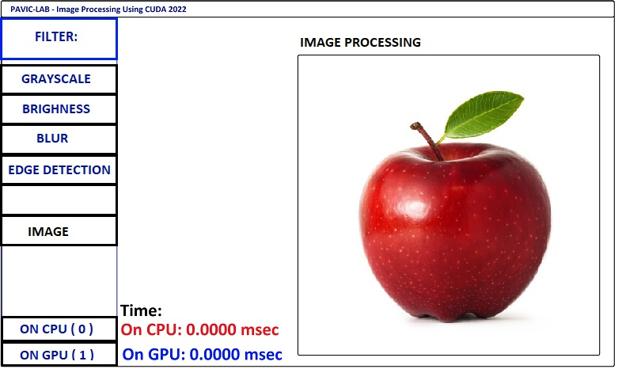

# Converting an Image to Grayscale using the GPU
##  Grayscale Wikipedia
---
## 

---

### Ref:
-  Ref: https://github.com/Ohjurot/CUDATutorial
-  Ref: https://www.youtube.com/watch?v=sltSyddAGNs
- REf: https://en.wikipedia.org/wiki/Grayscale#:~:text=or%2032%20bits.-,Converting%20color%20to%20grayscale,photographic%20filters%20on%20the%20cameras.*/

##  


--- 
This i the code for CUDA image processing color to Gray
``` C++
#include "cuda_runtime.h"
#include "device_launch_parameters.h"

#include <stdio.h>
#include<iostream>


// Load Image and Write Image

#include"../includes/stb_image.h"
#include"../includes/stb_image_write.h"
#include <string>
#include <cassert>

/*
Color to Grayscale Equation
Ylinear = 0.2126RLinear + 0.7152GLiners +0.0722BLiners
*/
```

/*
To Load Images in C++
STB Libraris
Ref: https://github.com/nothings/stb
    Image loader: stb_image.h
    Image writer: stb_image_write.h

    folder: C:\Users\ansor\source\repos\stb
*/
